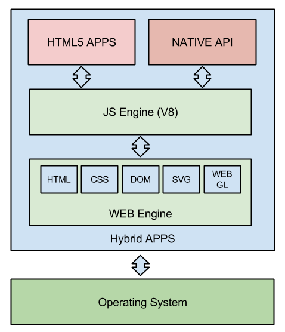

#Pendahuluan

#Aplikasi Hibrida
Hybrid apps are native apps that use an embedded browser for implementing the user interface (UI). Hybrid apps
consist of an embedded browser, JavaScript libraries, acollection of assets (e.g. locally stored XHTML pages) and
custom libraries that allow accessing the native OS features. 
#IGN-SDK
#Pengembangan Aplikasi
#Kesimpulan

